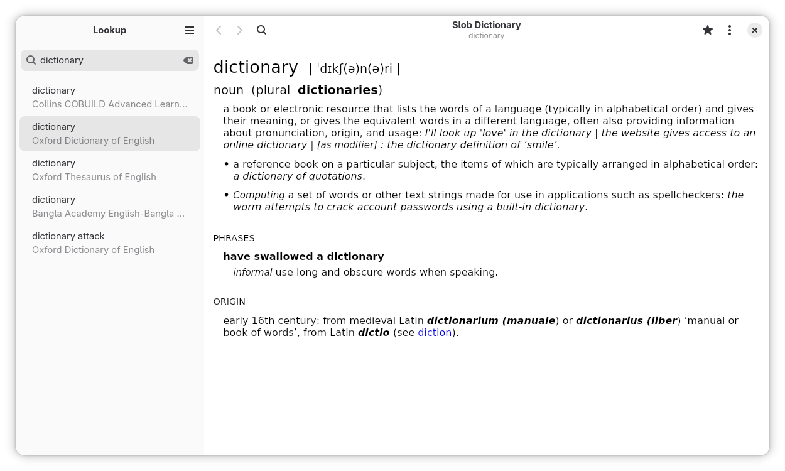

# Slob Dictionary

Slob Dictionary is an application with a polished GTK 4 interface for exploring slob-formatted dictionaries on Linux, converting when necessary.



## Key Features

- Fast and simultaneous lookup across multiple dictionary files
- Persistent lookup history to revisit entries effortlessly
- Lookup directly from GNOME Activities (see below)
- Lookup using URI (see below)
- Lookup from CLI (see below)
- Bookmarks for saving favorite definitions and terms
- Native light/dark mode following your GNOME desktop theme

## Supported Dictionary Formats

Aard 2 (.slob), Almaany.com (SQLite3), AppleDict Binary(.dictionary, .data), AyanDict SQLite, Babylon (.BGL), cc-kedict, Crawler Directory(.crawler), CSV (.csv), DictionaryForMIDs(.mids), Dict.cc (SQLite3), Dict.cc (SQLite3) - Split, DICT.org file format (.index), dictunformat output file(.dictunformat), DigitalNK (SQLite3, N-Korean), ABBYY Lingvo DSL (.dsl), Kobo E-Reader Dictfile (.df), EDICT2 (CEDICT) (.u8), EDLIN(.edlin), FreeDict (.tei), Gettext Source (.po), Glossary Info (.info), JMDict (xml), JMnedict, Lingoes Source (.ldf), Makindo Medical Reference (SQLite3), Octopus MDict (.mdx), QuickDic version 6 (.quickdic), StarDict (.ifo), StarDict Textual File (.xml), Tabfile (.txt, .dic), Test Format File(.test), Wiktextract (.jsonl), WordNet, Wordset.org JSON directory, XDXF (.xdxf), XDXF with CSS and JS, XDXF Lax (.xdxf), Yomichan (.zip), Zim (.zim, for Kiwix).

## GNOME Activities Support

To lookup dictionaries directly from GNOME Activities, you need to enable the feature in Settings > Search > Slob Dictionary.

## URI Support

The application currently supports the following URIs:
- `slobdict://search/{search_term}`: Look for the given `{search_term}` (e.g., `slobdict://search/hello`)
- `slobdict://lookup/{term}`: Lookup the given `{term}` and also open the definition of the first matching result (e.g., `slobdict://lookup/hello`)
- `slobdict://lookup/{search_term}/{term}`: Lookup the given `{search_term}` and also open the definition of the first matching result of `{term}` (e.g., `slobdict://lookup/hell/hello`)

## Terminal/CLI Support

Run `slobdict` or `flatpak run dev.muntashir.SlobDictGTK -h` for help.

> Slob Dictionary attempts to render formatted HTML/Markdown in the console, but it is not guaranteed to match the actual formatted HTML rendered by a web browser due to inherent limitations.

## Permissions Used

The application requires network access for loading remote contents, but it is disabled by default for privacy.

## Building

### Install dependencies

```sh
sudo dnf install gtk4-devel libadwaita-devel python3-gobject
sudo dnf install gcc-c++ libicu-devel python3-devel
sudo dnf install meson ninja-build
```

### Build and Run Locally

```sh
./mason_run_local.sh
```

or

```sh
./flatpak_run_local.sh
```

### Build Flatpak

```sh
./flatpak_build_release.sh
```

## Credits

- https://github.com/timlau/adw_template_app
- https://github.com/cosimoc/gnome-example-search-provider

## License

AGPL-3.0-or-later
